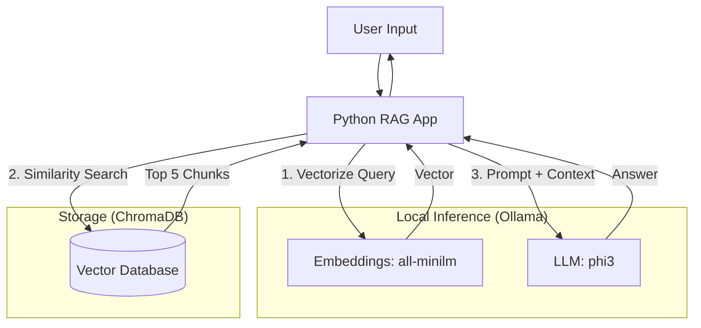

# Problem 1: Minimal RAG Solution

## 1. High-Level Architecture

## 2. Component Implementation

| Component | Implementation | Description |
| :--- | :--- | :--- |
| **Knowledge Base** | `ChromaDB` | A local, in-memory vector store for efficient similarity search. |
| **Semantic Layer** | `all-minilm` | A lightweight embedding model (via Ollama) converting text to 384-dim vectors. |
| **Retrieval** | `Cosine Similarity` | Retrieves the top 5 (`k=5`) most relevant chunks based on vector proximity. |
| **Augmentation** | `Prompt Engineering` | Injects retrieved text into a strict system prompt to ground the LLM's response. |
| **Generation** | `Phi-3` | A 3.8B parameter SLM running locally on CPU to synthesize the final answer. |

## 3. Challenges and learnings
- context starvation: originally, the retriveal parameter "n_results" was initially set to 1 to retrieve the single, most relevant vector. however, this meant that when a query requested info from multiple chunks, it'd fail to retrieve all of them. e.g "list all key components" when all the components were in different strings. to solve this, n_results was changed to 5.

- conversation Loop hallucination: originally, the llm wouldn't know when to stop as it wants to be as helpful as possible. hence, after answering the initial query, it began roleplaying both sides of a conversation and never stop. to overcome this, "Do not add conversational filler. Do not make up questions." was appended to the context to ensure conciseness.
